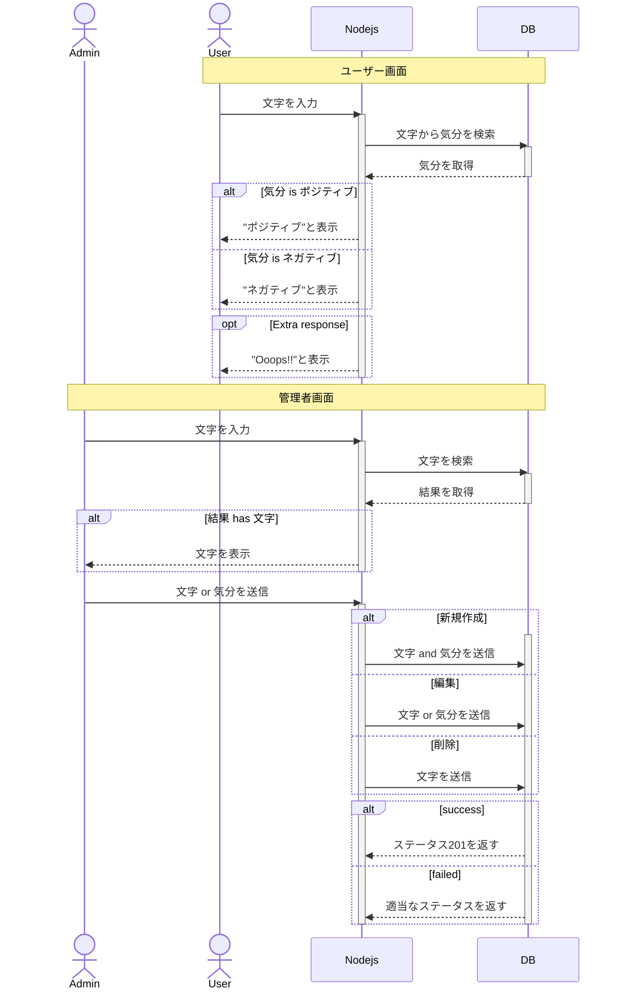

# beposi

## システム化の背景

## システム化の目的

## システム化の業務フロー



## About

- つぶやいて気分を判定するだけのシンプルな仕様
- API 理解のために作成した Web アプリ
- "8BJP6HdVTGgeSd"とつぶやくと管理画面に遷移する

## Pre-requests

- Language: Node.js
- Database: MySQL

## How to Local start

```
git clone https://github.com/hello-ty/beposi.git
cd beposi
vi .env
npm install
npm run compile
npm run start
```

## Server Environment Settings (.env file)

```
# MySQLへの接続情報を設定する
DATABASE_URL="database_url_of_planetscale"

# ログファイルを設定する
LOG_DIR='path_of_log_directory'
```

## Database Specification

```
# つぶやきを管理するマスターテーブル
CREATE TABLE beposi.words (
  id INT NOT NULL AUTO_INCREMENT,
  text VARCHAR(128) NOT NULL,
  mind INT NOT NULL,
  PRIMARY KEY (id)
);
```
